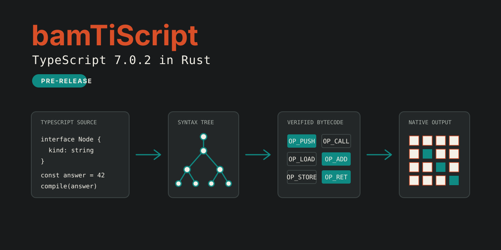

# bamTiScript



[](https://github.com/metaphorics/bamTiScript/actions/workflows/pr.yml)

[](LICENSE)

bamTiScript is a clean-room Rust implementation of TypeScript 7.0.2 with a `tsc`-compatible command line, type checking, JavaScript execution, native code generation, and formal models.

> [!WARNING]
> bamTiScript is pre-release software. The repository contains active compatibility work. Treat passing checks and recorded receipts as evidence for specific behavior, not as a claim of complete TypeScript parity.

## What is in the repository

- A TypeScript parser, binder, checker, emitter, project system, and language-service surface.
- A JavaScript bytecode runtime with interpreter, JIT, and AOT execution paths.
- A Node.js 24 host layer and a source-built `bamts` command that accepts TypeScript compiler arguments.
- Compatibility catalogs, corpus cases, target-cell records, performance guards, and formal models.

The `.references/` directory is study material. bamTiScript does not copy implementation code from it.

## Quick start

You need Git and Rust 1.97.1. The workspace uses Rust 2024.

```bash
git clone https://github.com/metaphorics/bamTiScript.git
cd bamTiScript
printf 'const answer: number = 42;\nanswer;\n' > hello.ts
cargo run -p bamts-cli -- --noEmit --pretty false hello.ts
```

On success, `bamts` emits no TypeScript diagnostics and exits with status 0. Remove the sample when you finish:

```bash
rm hello.ts
```

## Install from source

The project does not publish a stable registry release yet. Install the current command from the checkout:

```bash
cargo install --path crates/bamts-cli
bamts --version
```

The command reports the compatibility target:

```text
Version 7.0.2
```

## Usage

Check one or more files without emitting JavaScript:

```bash
bamts --noEmit --pretty false src/index.ts
```

Compile the project selected by a `tsconfig.json` file:

```bash
bamts -p ./path/to/tsconfig.json
```

Print the command reference:

```bash
bamts --help
```

The current help output identifies the command as the TypeScript compiler compatibility surface and documents file compilation, project compilation, build mode, initialization, help, and version flags.

## Workspace map

| Path | Responsibility |
| --- | --- |
| `crates/bamts-compiler` | TypeScript syntax, binding, checking, emitting, projects, and services |
| `crates/bamts-bytecode` | Verified bytecode format and decoder |
| `crates/bamts-runtime` | JavaScript values, built-ins, modules, event loop, and interpreter |
| `crates/bamts-codegen` | JIT and AOT lowering |
| `crates/bamts-native` | Native execution bridge |
| `crates/bamts-node` | Node.js host behavior used by the product |
| `crates/bamts-cli` | `bamts` command-line driver and API transport |
| `crates/bamts-verification` | Catalogs, suites, evidence, targets, performance, and completion checks |
| `formal` | Racket, Lean 4, and Quint models and bindings |
| `corpus` | TypeScript projects and focused compatibility cases |

## Verification

Run the Rust workspace checks from the repository root:

```bash
cargo fmt --check
cargo clippy --workspace --all-targets -- -D warnings
cargo test --workspace --locked
```

The GitHub workflows add catalog, corpus, formal, target, and release checks. See [`.github/workflows/pr.yml`](.github/workflows/pr.yml), [`.github/workflows/nightly.yml`](.github/workflows/nightly.yml), and [`.github/workflows/weekly-audit.yml`](.github/workflows/weekly-audit.yml) for the commands that each lane runs.

Generate local API documentation with:

```bash
cargo doc --workspace --no-deps
```

## Contributing

Read [CONTRIBUTING.md](CONTRIBUTING.md) before sending a change. A good report includes a minimal TypeScript input, the observed diagnostic or runtime result, the expected TypeScript 7.0.2 result, and the exact command used to reproduce it.

## License

bamTiScript is available under the [MIT License](LICENSE).
