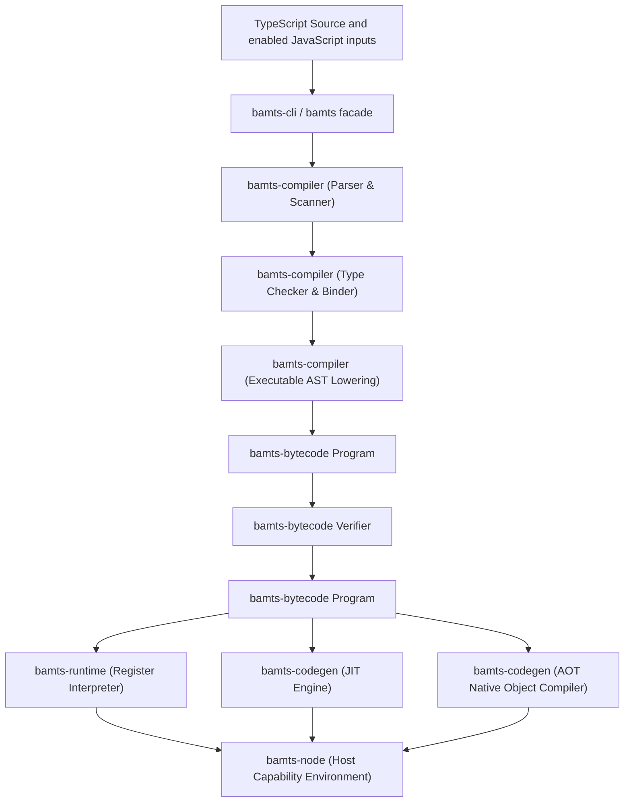

# Architecture and component guide

This document maps bamTiScript 0.2.0 components, data flow, string representation, safety policy, and host boundaries.

## Component ownership

For technical contributors seeking to locate specific functionality, the following table maps language responsibilities to workspace crates and primary module entry points:

| Responsibility | Owning crate | Relative path | Key source files |
| :--- | :--- | :--- | :--- |
| **Facade & Public API** | `bamts` | [`../../crates/bamts`](../../crates/bamts) | [`src/lib.rs`](../../crates/bamts/src/lib.rs) |
| **CLI & Process Driver** | `bamts-cli` | [`../../crates/bamts-cli`](../../crates/bamts-cli) | [`src/main.rs`](../../crates/bamts-cli/src/main.rs), [`src/cli/tsc_args.rs`](../../crates/bamts-cli/src/cli/tsc_args.rs), [`src/driver.rs`](../../crates/bamts-cli/src/driver.rs), [`src/args.rs`](../../crates/bamts-cli/src/args.rs) |
| **Parsing & Scanning** | `bamts-compiler` | [`../../crates/bamts-compiler`](../../crates/bamts-compiler) | [`src/parser.rs`](../../crates/bamts-compiler/src/parser.rs), [`src/scanner.rs`](../../crates/bamts-compiler/src/scanner.rs), [`src/syntax.rs`](../../crates/bamts-compiler/src/syntax.rs) |
| **Type Checking & Binding** | `bamts-compiler` | [`../../crates/bamts-compiler`](../../crates/bamts-compiler) | [`src/checker.rs`](../../crates/bamts-compiler/src/checker.rs), [`src/checker/binder.rs`](../../crates/bamts-compiler/src/checker/binder.rs), [`src/checker/inference.rs`](../../crates/bamts-compiler/src/checker/inference.rs) |
| **Semantic Rules & Lints** | `bamts-compiler` | [`../../crates/bamts-compiler`](../../crates/bamts-compiler) | [`src/rules/`](../../crates/bamts-compiler/src/rules/), [`src/lint.rs`](../../crates/bamts-compiler/src/lint.rs), [`RULES.md`](../../crates/bamts-compiler/RULES.md) |
| **Executable AST Lowering** | `bamts-compiler` | [`../../crates/bamts-compiler`](../../crates/bamts-compiler) | [`src/lower.rs`](../../crates/bamts-compiler/src/lower.rs), [`src/program.rs`](../../crates/bamts-compiler/src/program.rs), [`src/pipeline.rs`](../../crates/bamts-compiler/src/pipeline.rs) |
| **Source & Declaration Emitter** | `bamts-compiler` | [`../../crates/bamts-compiler`](../../crates/bamts-compiler) | [`src/emitter.rs`](../../crates/bamts-compiler/src/emitter.rs) |
| **Bytecode IR & Verifier** | `bamts-bytecode` | [`../../crates/bamts-bytecode`](../../crates/bamts-bytecode) | [`src/lib.rs`](../../crates/bamts-bytecode/src/lib.rs), [`src/program.rs`](../../crates/bamts-bytecode/src/program.rs), [`src/string.rs`](../../crates/bamts-bytecode/src/string.rs) |
| **Interpreter & Garbage Collector** | `bamts-runtime` | [`../../crates/bamts-runtime`](../../crates/bamts-runtime) | [`src/vm.rs`](../../crates/bamts-runtime/src/vm.rs), [`src/gc.rs`](../../crates/bamts-runtime/src/gc.rs), [`src/intrinsics.rs`](../../crates/bamts-runtime/src/intrinsics.rs) |
| **Standard Builtins** | `bamts-runtime` | [`../../crates/bamts-runtime`](../../crates/bamts-runtime) | [`src/builtins/`](../../crates/bamts-runtime/src/builtins/) (`object.rs`, `array.rs`, `string.rs`, `promise.rs`, etc.) |
| **JIT & AOT Codegen** | `bamts-codegen` | [`../../crates/bamts-codegen`](../../crates/bamts-codegen) | [`src/jit.rs`](../../crates/bamts-codegen/src/jit.rs), [`src/aot.rs`](../../crates/bamts-codegen/src/aot.rs), [`src/jit_memory.rs`](../../crates/bamts-codegen/src/jit_memory.rs) |
| **Native ABI & Value Layout** | `bamts-native` | [`../../crates/bamts-native`](../../crates/bamts-native) | [`src/lib.rs`](../../crates/bamts-native/src/lib.rs), [`src/native_bridge.rs`](../../crates/bamts-native/src/native_bridge.rs) |
| **Node Host & Capabilities** | `bamts-node` | [`../../crates/bamts-node`](../../crates/bamts-node) | [`src/lib.rs`](../../crates/bamts-node/src/lib.rs), [`src/timers.rs`](../../crates/bamts-node/src/timers.rs) |
| **Cancellation Ownership** | `bamts-cancel` | [`../../crates/bamts-cancel`](../../crates/bamts-cancel) | [`src/lib.rs`](../../crates/bamts-cancel/src/lib.rs) |
| **Node-API Native Addon** | `bamts-napi` (private) | [`../../crates/bamts-napi`](../../crates/bamts-napi) | [`src/lib.rs`](../../crates/bamts-napi/src/lib.rs) |
| **Validation & Test Harness** | `bamts-verification` | [`../../crates/bamts-verification`](../../crates/bamts-verification) | [`src/lib.rs`](../../crates/bamts-verification/src/lib.rs), [`src/corpus.rs`](../../crates/bamts-verification/src/corpus.rs), [`src/formal_gates.rs`](../../crates/bamts-verification/src/formal_gates.rs) |

---

## End-to-end pipeline



### 1. Invocation and orchestration
- CLI (`crates/bamts-cli`): Accepts the TypeScript 7.0.2 `tsc` argument model. [`src/main.rs`](../../crates/bamts-cli/src/main.rs) parses through [`src/cli/tsc_args.rs`](../../crates/bamts-cli/src/cli/tsc_args.rs). [`src/driver.rs`](../../crates/bamts-cli/src/driver.rs) loads configuration, compiles the module graph, and renders diagnostics. The legacy `check`, `run`, `compile`, `explain`, and `--target aot|jit` forms are not public commands; they remain only in the internal `--api` parser (`src/args.rs`).
- Facade (`crates/bamts`): Exposes Rust functions for compiling and running source entrypoints and, with the `aot` feature, producing native object files. It translates subsystem errors into [`bamts::Error`](../../crates/bamts/src/lib.rs).

### 2. Frontend compilation
- Parsing and scanning: [`src/parser.rs`](../../crates/bamts-compiler/src/parser.rs) and [`src/scanner.rs`](../../crates/bamts-compiler/src/scanner.rs) convert raw source text into TypeScript AST constructs.
- Symbol binding and type checking: [`src/checker.rs`](../../crates/bamts-compiler/src/checker.rs) coordinates symbol table resolution (`binder.rs`), relation checking (`relations.rs`), control-flow narrowing (`narrowing.rs`), and type inference (`inference.rs`).
- Semantic rules: Evaluates compiler safety and compliance rules defined in [`src/rules/`](../../crates/bamts-compiler/src/rules/) and documented in [`RULES.md`](../../crates/bamts-compiler/RULES.md).
- Lowering: [`src/lower.rs`](../../crates/bamts-compiler/src/lower.rs) converts checked AST structures into register-oriented IR structures, outputting an unverified bytecode container (`Program<Unverified>`).

### 3. Bytecode and verification
- Wire format and instructions: Defines the register instruction algebra, function signatures, constant pools, and program metadata in [`src/program.rs`](../../crates/bamts-bytecode/src/program.rs) and [`src/lib.rs`](../../crates/bamts-bytecode/src/lib.rs).
- Static verification: [`src/program.rs`](../../crates/bamts-bytecode/src/program.rs) verifies module and linkage invariants before it produces `Program<Verified>`. Runtime and code-generation entry points consume that verified type.

### 4. Execution targets
- Interpreter (`bamts-runtime`): [`src/vm.rs`](../../crates/bamts-runtime/src/vm.rs) runs verified bytecode. [`src/gc.rs`](../../crates/bamts-runtime/src/gc.rs) owns garbage collection, and [`src/builtins/`](../../crates/bamts-runtime/src/builtins/) owns language globals and intrinsic objects.
- Native code generation (`bamts-codegen` and `bamts-native`):
  - JIT: [`src/jit.rs`](../../crates/bamts-codegen/src/jit.rs) translates verified bytecode for in-process execution. [`src/jit_memory.rs`](../../crates/bamts-codegen/src/jit_memory.rs) owns executable-memory lifecycle.
  - AOT: [`src/aot.rs`](../../crates/bamts-codegen/src/aot.rs) compiles verified bytecode into the native object consumed by the CLI's host linker.
  - ABI and values: [`crates/bamts-native`](../../crates/bamts-native) owns the ABI structures and value representation shared by runtime calls and generated code.

### 5. Host capabilities and Node.js interface
- Implements the [`bamts_runtime::Host`](../../crates/bamts-runtime/src/lib.rs) trait for the Node-style capabilities that the runtime currently exposes, including process output, arguments, environment access, timers, and selected hashing operations.
- Contains the process entry point used by AOT executables in [`src/lib.rs`](../../crates/bamts-node/src/lib.rs).
- The host surface is a subset. It is not full Node.js or Node-API compatibility.
- Exposes two distinct npm distribution surfaces:
  - `bamti-cli`: The standalone CLI transport package that resolves and executes the `bamts` binary executable on disk.
  - `bamti`: The in-process Node.js interface for Node.js 24 or later, embedding the compiler directly via native Node-API bindings (`bamts-napi`).
- Target design and fail-closed loading:
  - `bamti` specifies five optional native platform packages (`@bamti/bamti-linux-x64-gnu`, `@bamti/bamti-linux-arm64-gnu`, `@bamti/bamti-darwin-x64`, `@bamti/bamti-darwin-arm64`, `@bamti/bamti-win32-x64-msvc`).
  - `native-loader.js` resolves the optional platform package matching the host OS and architecture, validating package manifests, binary SHA-256 digests, and release metadata.
  - If the matching native package is missing or fails verification, artifact loading fails closed with an explicit error (`NativeArtifactNotFoundError` or `NativeArtifactLoadError`). It never falls back to downloading binaries or spawning the CLI.
- Cancellation and environment teardown ownership:
  - `bamts-cancel` owns atomic cancellation handles and execution interrupt triggers.
  - `bamts-napi` (private crate) owns N-API native bindings, isolate memory management, and environment teardown.

### 6. Validation
- Owns conformance classification, real-package differential execution, formal gates, and workspace guards. [Verification evidence and its limits](verification.md) are documented separately.

---

## String representation

ECMAScript strings are sequences of 16-bit code units and can contain lone surrogate code units (`0xD800`–`0xDFFF`). bamTiScript stores exact code units in `EcmaString`, backed by `Arc<[u16]>`, instead of converting the internal value to UTF-8.

For the boundary rules and regression tests, see:
- [Preserve ECMAScript strings as exact UTF-16 code units](../solutions/architecture-patterns/exact-ecmascript-utf16-strings.md)

---

## Workspace safety policy

The workspace manifest declares Rust edition 2024, minimum Rust version 1.97.1,
and this root lint default:

```toml
[workspace.lints.rust]
unsafe_code = "forbid"
```

### Policy boundaries
1. Most workspace crates inherit the `forbid` default.
2. `bamts-codegen`, `bamts-node`, `bamts-verification`, and private `bamts-napi` use `deny` with narrowly scoped exceptions. `bamts-native` contains documented unsafe FFI and native-bridge code.
3. These source policies and boundaries do not cover dependencies, system libraries, generated machine code, hardware, or the operating system. They are not an end-to-end memory-safety proof.

---

## Implementation status

- Version `0.2.0` is pre-release.
- `bamti` provides an in-process Node 24+ interface backed by Node-API bindings (`bamts-napi`) and an atomic cancellation handle (`bamts-cancel`), while `bamti-cli` acts as the standalone CLI transport.
- Loading optional platform packages is fail-closed.
- Currently published 0.1.0 npm packages do not contain prebuilt native binary artifacts. The native Node-API implementation is present in the source repository but is not yet published to npm.
- Real five-target release validation remains blocked by GitHub billing and is unverified.
