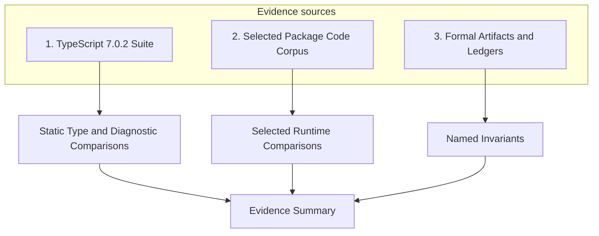

# Verification evidence

This document explains the evidence model for bamTiScript 0.2.0, the scope of recorded proofs, and the limits of current claims.

bamTiScript is pre-release software (version 0.2.0). Currently published 0.1.0 packages for `bamti` and `bamti-cli` do not contain prebuilt native binary artifacts. The in-process `bamti` Node-API native bindings (`bamts-napi`) exist in the source repository but are unpublished. Five-target release validation remains blocked by GitHub billing and is unverified.

## Three evidence sources

bamTiScript records three types of evidence:

1. A pinned TypeScript 7.0.2 conformance suite for diagnostic and static type-checking comparisons.
2. A differential corpus over selected code from pinned package repositories.
3. Formal source artifacts and gate ledgers for named state, lifecycle, bytecode, and ABI properties.

---

## TypeScript 7.0.2 conformance suite

The first evidence leg evaluates static analysis, parsing, and type checking against test cases from the official TypeScript 7.0.2 release.

TypeScript 7.0.2 serves as the project's compatibility oracle. Comparisons with `tsc` provide evidence for specific parsing, checking, inference, and diagnostic behaviors.

### Artifacts and schema mapping

* Suite schema: Conformance tracking files follow the structure defined in [`verification/ts-conformance-ledger.schema.json`](../../verification/ts-conformance-ledger.schema.json).
* Diagnostic code map: [`verification/diagnostic-code-map.json`](../../verification/diagnostic-code-map.json) records mappings that have TypeScript evidence and keeps unmapped codes explicit.
* Lint and strictness rules: Diagnostic warning levels and unsoundness mitigations are documented in [`crates/bamts-compiler/RULES.md`](../../crates/bamts-compiler/RULES.md).
* Manifest lock: Suite source pins and archive digests, extractor rules, identifier paths, and an ordered-identifier-set digest are locked in [`verification/manifest.lock.json`](../../verification/manifest.lock.json).

### Classification is not a pass rate

Diagnostic mapping inventories classified behavior. It does not state a total compatibility or pass rate.

---

## Differential corpus over selected vendored package code

Custom driver cases exercise selected code from pinned open-source package repositories and compare declared observations with Node.js 24.18.0. The harness does not run the packages' own test suites, package-manager scripts, or full distribution entrypoints. [`corpus/manifest.toml`](../../corpus/manifest.toml) pins each repository and declares the entrypoint and compared observations.

### Scope and string semantics

* Cases use only the Node.js host APIs that bamTiScript currently models. The corpus does not establish full Node.js compatibility.
* String-focused cases exercise exact 16-bit code-unit semantics. See [the UTF-16 solution note](../solutions/architecture-patterns/exact-ecmascript-utf16-strings.md) for the architecture rules.

---

## Formal artifacts and current gate status

Formal evidence applies only to the named properties and assumptions recorded in the source files and proof ledgers. The current completeness ledger records every Quint, Lean, and Redex catalog row as `BLOCKING_FAIL`. The artifacts below are inventories and gate inputs; their presence does not mean that the formal gates pass.

### Quint models

The Quint sources model named state-machine properties. The configuration files define reproducible witness and mutation runs:

* Witness configurations: [`proof/quint-normal-witnesses.json`](../../proof/quint-normal-witnesses.json) records the model, invariant, run name, seed, backend, and exploration bounds.
* Mutation configurations: [`proof/quint-mutations.json`](../../proof/quint-mutations.json) records the fault model, action, run name, seed, backend, and bounds.

### Lean 4 proofs

Lean sources and ledgers record the theorem inventory and its assumptions.

* Kernel assumptions: [`proof/lean-assumptions.json`](../../proof/lean-assumptions.json) lists the assumptions used by the recorded proofs.
* Proof ledger: [`proof/completeness-ledger.json`](../../proof/completeness-ledger.json) records the acceptance state of every named catalog row, including open blocking gates.

### Racket/Redex models

[`formal/redex/`](../../formal/redex) contains executable operational-semantics models. The formal gate runs them with the configured Racket/Redex toolchain; the completeness ledger records current acceptance status.

---

## Limits of current evidence

The current evidence does not prove:

* Full TypeScript compatibility: TypeScript 7.0.2 is used as a reference oracle for comparison. It is not a claim of complete language or type-system coverage.
* Public performance: Verification records functional and property evidence, not execution speed or production performance.
* npm distribution: Published 0.1.0 npm packages do not provide native binary artifacts. The source implementation of native Node-API bindings (`bamts-napi`) is unpublished, and real five-target release validation remains blocked by GitHub billing and is unverified. Optional native artifact loading is fail-closed.
* Production adoption: The evidence does not establish production-workload stability.
* Cross-platform runtime correctness: Runtime instructions currently target Linux x64. AOT compilation does not cross-compile. Non-Linux runtime behavior is not established here.
* Complete compiler or runtime verification: Source policies and named formal properties do not prove the complete compiler pipeline, virtual machine, generated code, dependencies, or native process boundary.
